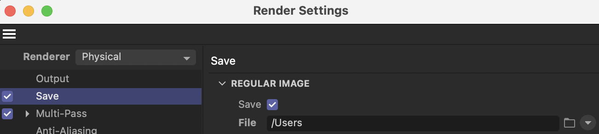
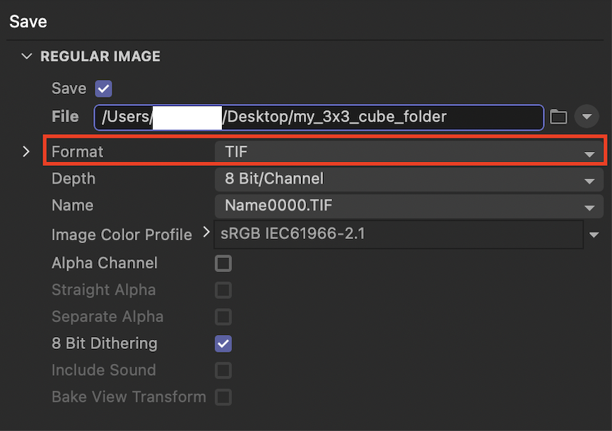
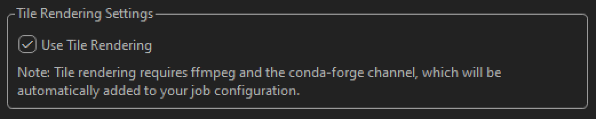
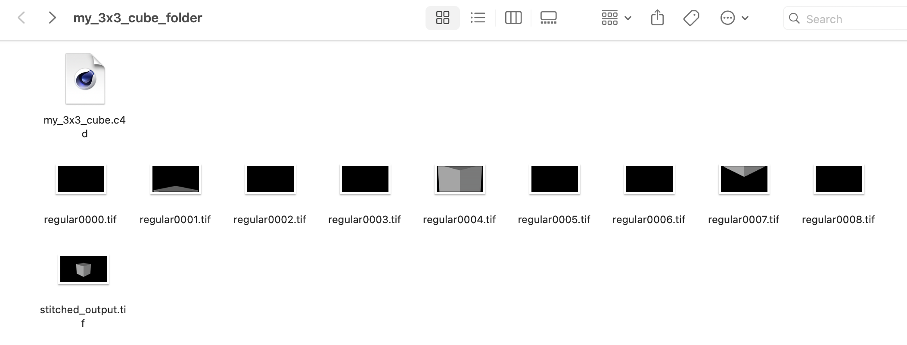

# Setting Up Tile Rendering in Cinema 4D for Deadline Cloud

*These instructions include a 3x3 tile render as an example.*

Tile rendering divides a single image into smaller sections (tiles) that are rendered separately across multiple workers, then automatically stitched back together into the final image. This approach can significantly reduce render times for large or complex scenes by distributing the workload.

## Important Notes About Tile Rendering

### Supported Features

* Job submission is supported from Windows and Mac workstations
* Tile rendering execution is supported on both Windows and Linux worker environments
* Use standard formats compatible with both Cinema 4D and ffmpeg:
    * TIF (recommended for highest quality)
    * PNG (good balance of quality and file size)
    * JPG/JPEG (smaller files, lossy compression)
    * TGA, BMP, HDR, DPX (also supported)

### Automatic Configuration

When you enable tile rendering, the submitter automatically:
* Adds `conda-forge` to the Conda channels
* Adds `ffmpeg` to the Conda packages (required for tile stitching)
* Sets the frame range in render settings based on your "Tiles per Axis" value (e.g., 3x3 tiles = frames 0-8)

### Current Limitations

* Using a Redshift renderer and camera
* Adding Render Tokens to the output paths

## Instructions:

### Initial Setup

#### Configure Render Settings

1. Go to "Render Settings" and set "Renderer" to "Physical"

#### Set Up Camera

1. Add a default camera object to your scene
2. Ensure the camera is using the Physical renderer
3. Position the camera to properly frame the objects you want to render

#### Add Render Tiles Camera

1. Locate the "Render Tiles" camera in the Asset Browser (under "Model" section)
2. Add it to your scene
3. Select the Render Tiles camera by clicking on the camera selection box

### Configure Tile Rendering

#### Configure Render Tiles Camera

1. Select the Render Tiles camera in your Objects panel
2. In Attributes → User Data:
    * Set "Tiles per Axis" (between 2-5, where 5x5 creates 25 tiles)
    * Set "Reference Camera" by dragging your default camera to this field
    * Check "Use Tiling" to enable tile rendering

#### Adjust Render Settings

1. In the "Save" tab:
    * Set the file path to your desired output folder
    * Choose either "REGULAR IMAGE", "MULTI-PASS IMAGE", or both
        * When using "MULTI-PASS IMAGE" output, you must check the "Multi-Layer file" option. This ensures proper processing of multi-pass data during tile stitching.
        * If you select both "REGULAR IMAGE" and "MULTI-PASS IMAGE" as save options:
            * Both outputs will be stitched separately, resulting in two final images
    * Select a supported format: tif, png, jpg, jpeg, tga, bmp, hdr, or dpx

### Submit to Deadline Cloud

#### Submit Your Job

1. Go to Extensions → AWS Deadline Cloud Submitter
    * In the "Job-specific settings" tab → "Tile Rendering Settings":
        * Check "Use Tile Rendering"

2. Submit the job

### Access Results

1. Once the job completes, download the output
2. Open the output folder to find the "stitched_output.tif" file containing your final rendered image

