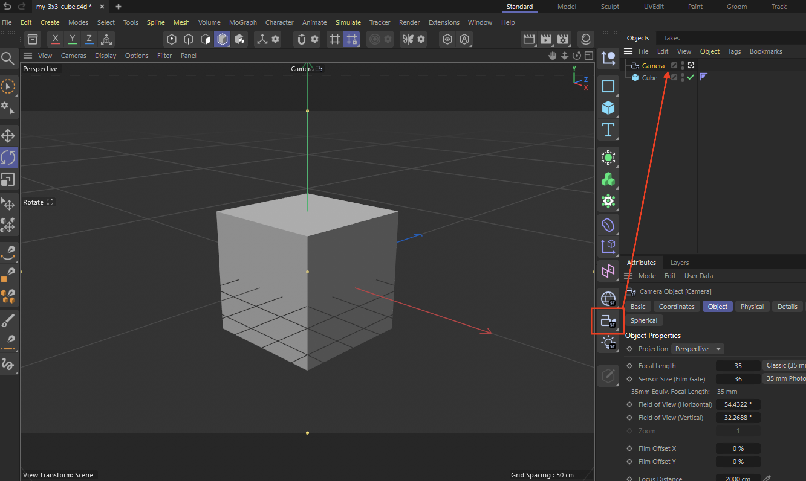
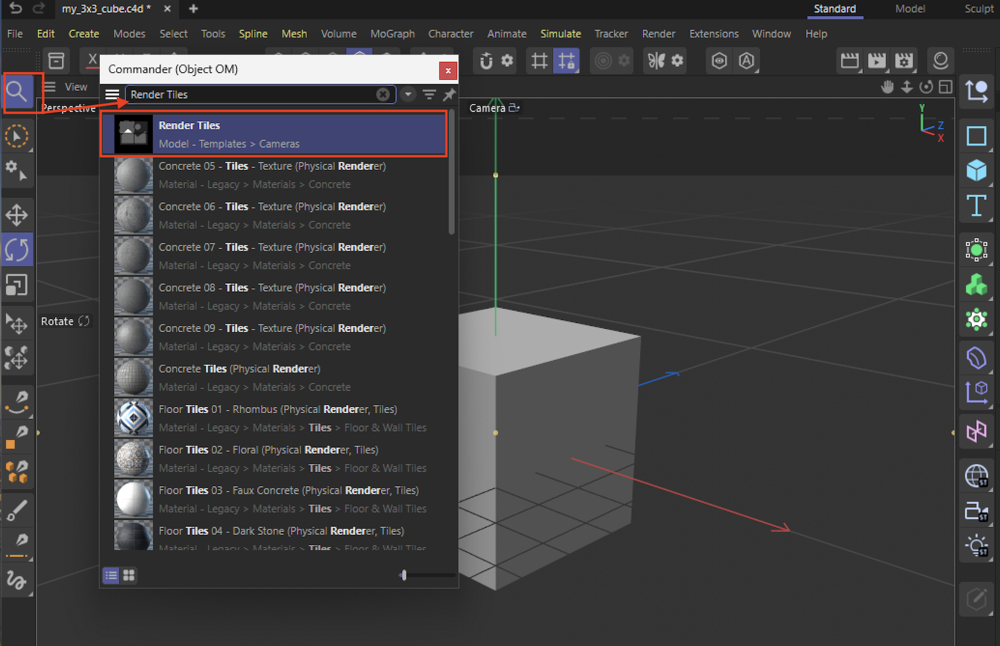
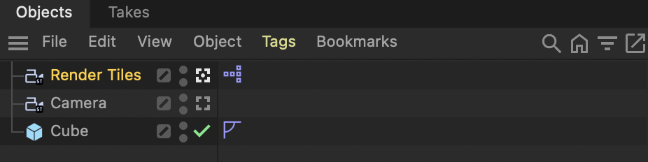
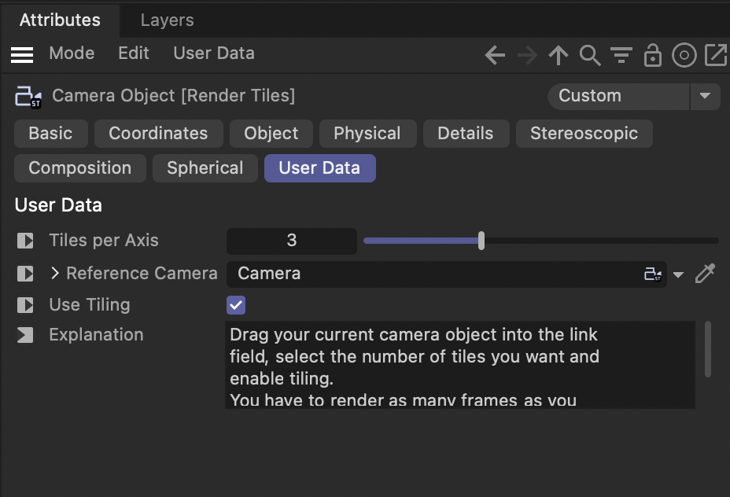
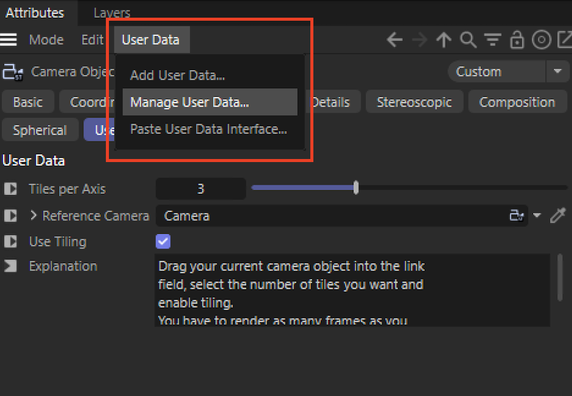
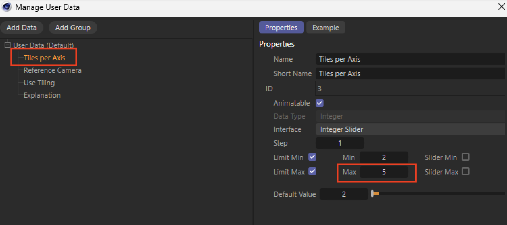
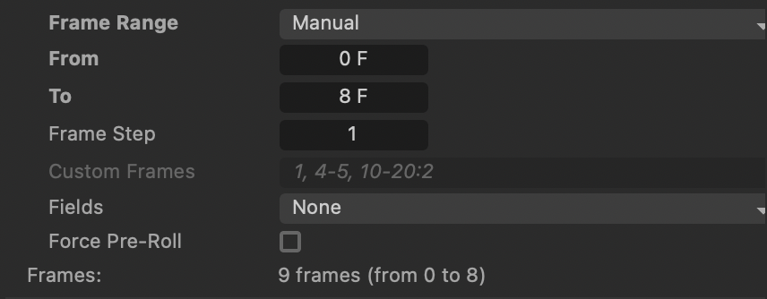
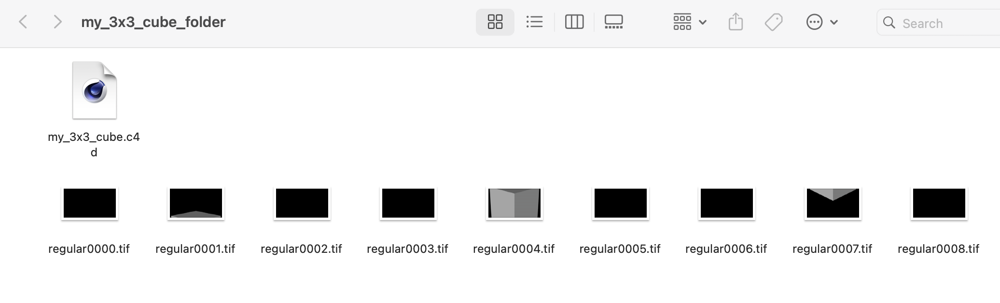

# Setting Up Tile Rendering in Cinema 4D for Deadline Cloud

*These instructions include a 3x3 tile render as an example.*

Tile rendering divides a single image into smaller sections (tiles) that are rendered separately. You will need to stitch these tiles back together yourself using professional image editing software or scripting tools. This approach can significantly reduce render times for large or complex scenes by distributing the workload.

## Renderer Compatibility

* You can use any renderer (Physical, Redshift, or Standard) for your scene
* **Important:** The reference camera used by the Render Tiles camera must be a Physical camera, regardless of your scene's renderer

## Instructions:

### Initial Setup

#### Set Up Camera

1. Add a physical camera object to your scene by clicking the camera icon (highlighted in the red box below). Verify in the camera's attributes that the type is set to "Physical"
2. Position the camera to properly frame the objects you want to render

#### Add Render Tiles Camera

1. Locate the "Render Tiles" camera in the Asset Browser (under "Model" section)

2. Add it to your scene
3. Select the Render Tiles camera by clicking on the camera selection box

**Why two cameras?** The Render Tiles camera uses your default camera as a reference to know what scene view to divide into tiles. The default camera defines the composition and framing, while the Render Tiles camera handles the technical process of splitting that view into smaller sections.

### Configure Tile Rendering

#### Configure Render Tiles Camera

1. Select the Render Tiles camera in your Objects panel
2. In Attributes → User Data:
    * Set "Tiles per Axis" (between 2-5, where 5x5 creates 25 tiles)
    * Set "Reference Camera" by dragging your default camera to this field
    * Check "Use Tiling" to enable tile rendering

#### Increasing Tiles per Axis Limit (Optional)

If you need more than 5 tiles per axis, you can modify the limit:

1. Select the Render Tiles camera
2. Go to Attributes → Manage User Data

3. Find "Tiles per Axis" and modify the maximum value
4. Click OK to apply the changes

#### Adjust Render Settings

1. Go to Render → Render Settings
2. In the "Output" tab:
    1. Set "Frame Range" to Manual
    2. Set "From" to 0
    3. Set "To" to (number of tiles - 1)

### Submit Job

Once you've completed the setup, simply submit your job to Deadline Cloud and you should see your tiles being rendered. Download your output to see the rendered tiles. Here is an example:

**Note:** You will need to stitch the individual tiles together yourself using professional image editing software or scripting tools to create the final composite image.
