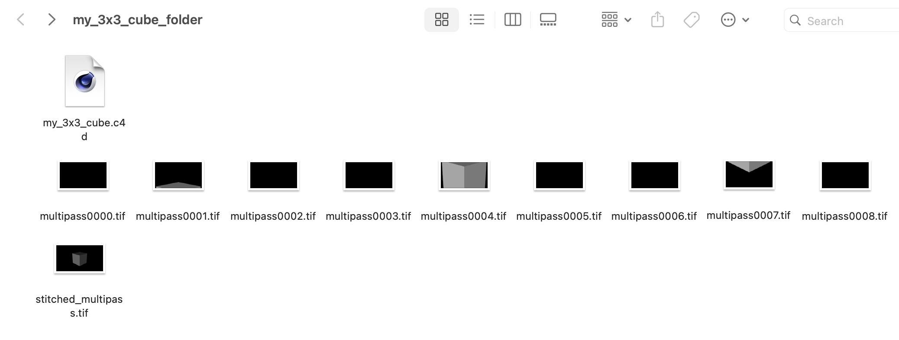
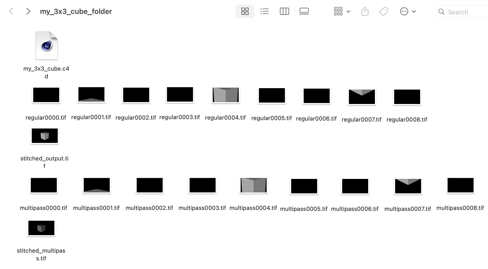

# Setting Up Tile Rendering in Cinema 4D for Deadline Cloud

*These instructions include a 3x3 tile render as an example.*

Tile rendering divides a single image into smaller sections (tiles) that are rendered separately across multiple workers, then automatically stitched back together into the final image using ffmpeg (a multimedia processing tool). This approach can significantly reduce render times for large or complex scenes by distributing the workload.
**File Size:** The final stitched image maintains the same dimensions and file size as a normal render - tile rendering doesn't affect the final image quality or size, only the rendering process.

## Important Notes About Tile Rendering

### Supported Features

* Job submission is supported from Windows and Mac workstations
* Tile rendering execution is supported on both Windows and Linux worker environments
* Use standard formats compatible with both Cinema 4D and ffmpeg:
    * TIF (recommended for highest quality)
    * PNG (good balance of quality and file size)
    * JPG/JPEG (smaller files, lossy compression)
    * TGA, BMP, HDR, DPX (also supported)

### Fleet Type Compatibility

**Service Managed Fleets (SMF):** AWS-managed compute resources where Deadline Cloud automatically handles software installation. Tile rendering works out-of-the-box with automatic ffmpeg installation via the `deadline-cloud` conda channel.

**Customer Managed Fleets (CMF):** Your own compute resources that you manage. CMF can use their own conda channels or package management. For tile rendering to work, ffmpeg must be available on worker nodes either through:
- Pre-installation on the worker nodes
- Custom conda channels that include ffmpeg
- **Important:** If using conda, ensure your existing conda channels either include ffmpeg or don't conflict with it. Conda searches channels in order and will fail if an earlier channel has an incompatible ffmpeg package, even though `conda-forge` is automatically added as a fallback channel.

### Automatic Configuration

When you enable tile rendering, the submitter automatically:
* Adds `conda-forge` to the Conda channels (a community-maintained package repository that provides ffmpeg)
* Adds `ffmpeg` to the Conda packages (a multimedia processing tool required to stitch the individual tiles back into the final image)
* Sets the frame range in render settings based on your "Tiles per Axis" value (e.g., 3x3 tiles = frames 0-8)

**Note for CMF:** The `conda-forge` channel is added to the end of your channel list. If your existing channels contain an incompatible ffmpeg package, conda will use that instead of the working version from `conda-forge`, potentially causing tile stitching to fail.

### Current Limitations

* Adding Render Tokens to the output paths

### Renderer Compatibility

* You can use any renderer (Physical, Redshift, or Standard) for your scene
* **Important:** The reference camera used by the Render Tiles camera must be a Physical camera, regardless of your scene's renderer

## Instructions:

### Initial Setup

#### Set Up Camera

1. Add a default physical camera object to your scene
2. Position the camera to properly frame the objects you want to render

#### Add Render Tiles Camera

1. Locate the "Render Tiles" camera in the Asset Browser (under "Model" section)
2. Add it to your scene
3. Select the Render Tiles camera by clicking on the camera selection box

**Why two cameras?** The Render Tiles camera uses your default camera as a reference to know what scene view to divide into tiles. The default camera defines the composition and framing, while the Render Tiles camera handles the technical process of splitting that view into smaller sections.

### Configure Tile Rendering

#### Configure Render Tiles Camera

1. Select the Render Tiles camera in your Objects panel
2. In Attributes → User Data:
    * Set "Tiles per Axis" (between 2-5, where 5x5 creates 25 tiles)
    * Set "Reference Camera" by dragging your default camera to this field
    * Check "Use Tiling" to enable tile rendering

#### Adjust Render Settings

1. In the "Save" tab:
    * Set the file path to your desired output folder
    * Choose either "REGULAR IMAGE", "MULTI-PASS IMAGE", or both
        * When using "MULTI-PASS IMAGE" output, you must check the "Multi-Layer file" option. Multi-Layer files store different render passes (like diffuse, specular, shadows) as separate layers within a single file, which is required for the tile stitching process to properly combine multi-pass data from all tiles.
        * If you select both "REGULAR IMAGE" and "MULTI-PASS IMAGE" as save options:
            * Both outputs will be stitched separately, resulting in two final images
    * Select a supported format: tif, png, jpg, jpeg, tga, bmp, hdr, or dpx

### Submit to Deadline Cloud

#### Submit Your Job

1. Go to Extensions → AWS Deadline Cloud Submitter
    * In the "Job-specific settings" tab → "Tile Rendering Settings":
        * Check "Use Tile Rendering"

2. Submit the job

### Access Results

1. Once the job completes, download the output
2. Open the output folder to find your final rendered image(s):

**If you selected REGULAR IMAGE only:**
- You'll find `stitched_output.tif` containing your final rendered image

**If you selected MULTI-PASS IMAGE:**
- You'll find `stitched_multipass.tif` containing your multi-pass rendered image with all render passes combined

**If you selected both REGULAR IMAGE and MULTI-PASS IMAGE:**
- You'll find both `stitched_output.tif` and `stitched_multipass.tif` files
- Each represents the same scene but with different rendering data (standard vs multi-pass)

