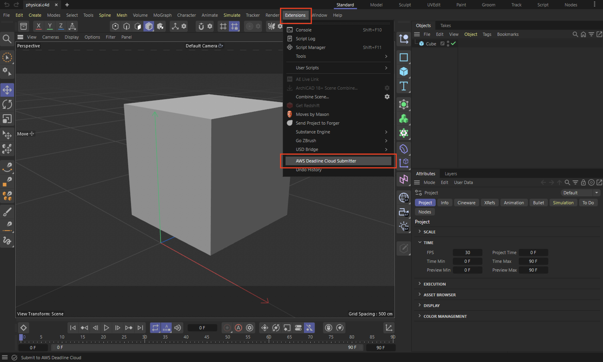
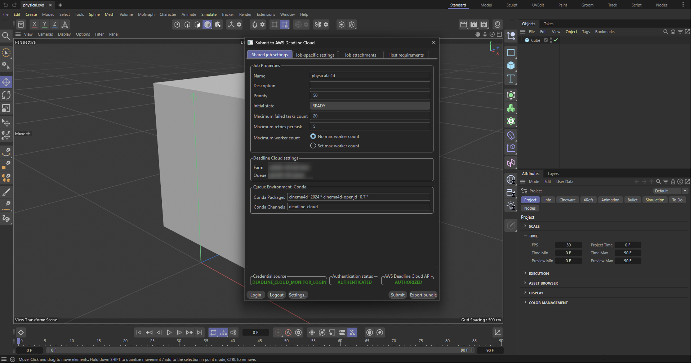
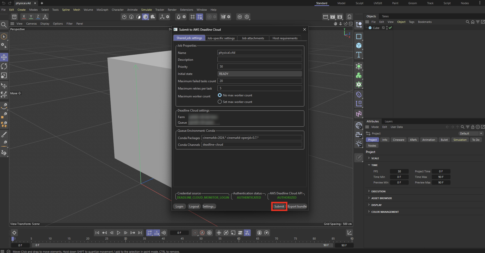
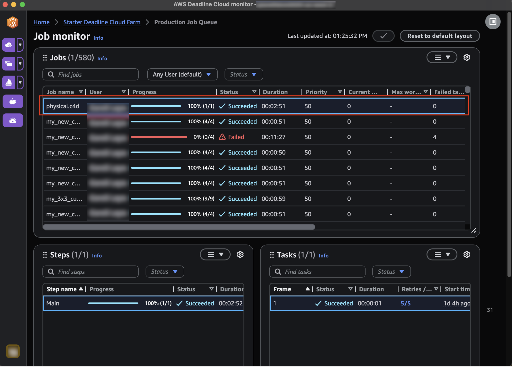
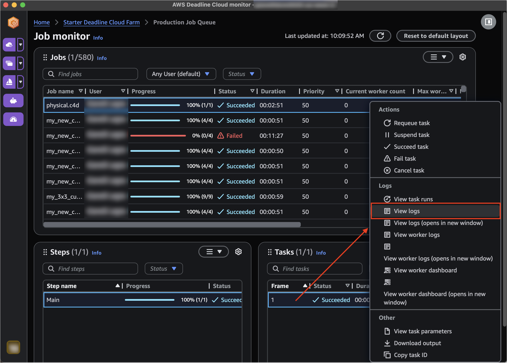
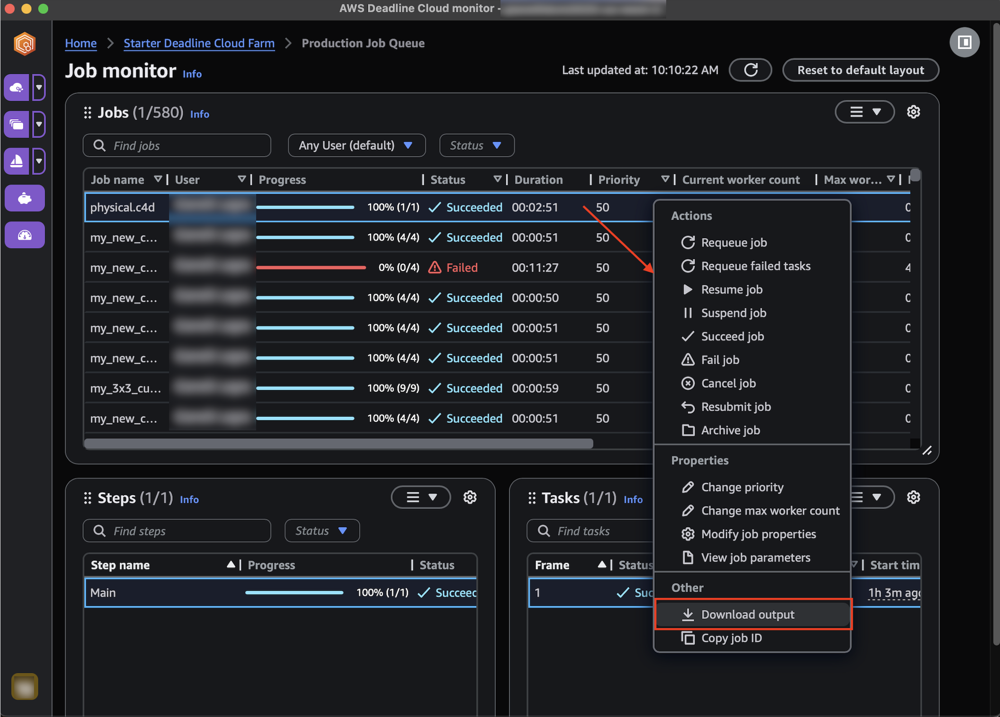

# Quick Start

Set up Cinema 4D and AWS Deadline Cloud in just a few steps.

## What You'll Need

- **Cinema 4D 2024 - 2026** installed on your workstation
   - Redshift, Arnold, and Cargo are supported natively
- **Windows or macOS** workstation for job submission
- **Deadline Cloud monitor** ([download here](https://docs.aws.amazon.com/deadline-cloud/latest/userguide/monitor-onboarding.html))
- **Access to an AWS Deadline Cloud farm** with either:
    - A Windows service-managed fleet, or
    - A customer-managed fleet with Cinema 4D, the Cinema 4D adaptor, and licensing set up

## Step 1: Install the Submitter (5 minutes)

The submitter adds AWS Deadline Cloud functionality to Cinema 4D's Extensions menu, allowing you to submit your scene directly to Deadline Cloud to manage the rendering.

**[Download the Official Installer](https://docs.aws.amazon.com/deadline-cloud/latest/userguide/submitter.html)** ← Start here (recommended)

1. Run the installer and follow the on-screen instructions
2. Launch Cinema 4D after installation
3. Verify the submitter appears in `Extensions` > `AWS Deadline Cloud Submitter`

[Learn about submitter features →](submitter-features.md)

## Updating the Submitter

To update the submitter to the latest version, download and run the latest [submitter installer](https://docs.aws.amazon.com/deadline-cloud/latest/userguide/submitter.html).

## System-Wide Installation for Multiple Users (Windows)

For shared workstations or enterprise environments where multiple users need access to the Cinema 4D submitter, you can perform a system-wide installation.

### Prerequisites

- Administrator account access
- Cinema 4D installed on the system

### Installation Steps

1. **Install the submitter as Administrator:**
   - Run the [Deadline Cloud submitter installer](https://docs.aws.amazon.com/deadline-cloud/latest/userguide/submitter.html) as Administrator
   - Select "system installation" option during installation

2. **Initial dependency setup:**
   - Open Cinema 4D as Administrator (right-click → "Run as administrator")
   - Access the submitter (`Extensions` > `AWS Deadline Cloud Submitter`)
   - Click "Yes" when prompted to install GUI dependencies
   - This configures permissions so all users can access the installed packages

3. **Regular usage:**
   - After initial setup, any user can open Cinema 4D normally (without Administrator privileges)
   - The AWS Deadline Cloud Submitter will be available to all users

For troubleshooting permission issues, see the [FAQ and Glossary →](faq-and-glossary.md)

## Step 2: Submit Your First Render (2 minutes)

1. Open Cinema 4D and load a scene.
2. Make sure your scene is saved.
3. Set up your camera angles, materials, and lighting as desired.
4. Go to `Extensions` > `AWS Deadline Cloud Submitter`.

5. Review your render settings.
6. Click Submit!

## Step 3: Monitor Your Renders

If you haven't already, install the Deadline Cloud monitor from the requirements above.

After submitting a job, open Deadline Cloud monitor (DCM) to view the job's progress. The submitter will create a job with a single step and one task per frame.

To view rendering logs, right-click on a task and choose "View logs".

Viewing logs is especially useful for troubleshooting failed jobs.

## Step 4: Download Your Results

Once your render job completes successfully, you can download the rendered frames.

1. In Deadline Cloud Monitor, locate your completed job.
2. Right-click on the job name.
3. Select "Download output" from the context menu.
4. Choose where to save your rendered files.
5. The download will begin automatically.

Your rendered frames will be organized in the same structure as specified in your output settings.

---

[Learn about submitter features →](submitter-features.md)

[FAQ and Glossary →](faq-and-glossary.md)
