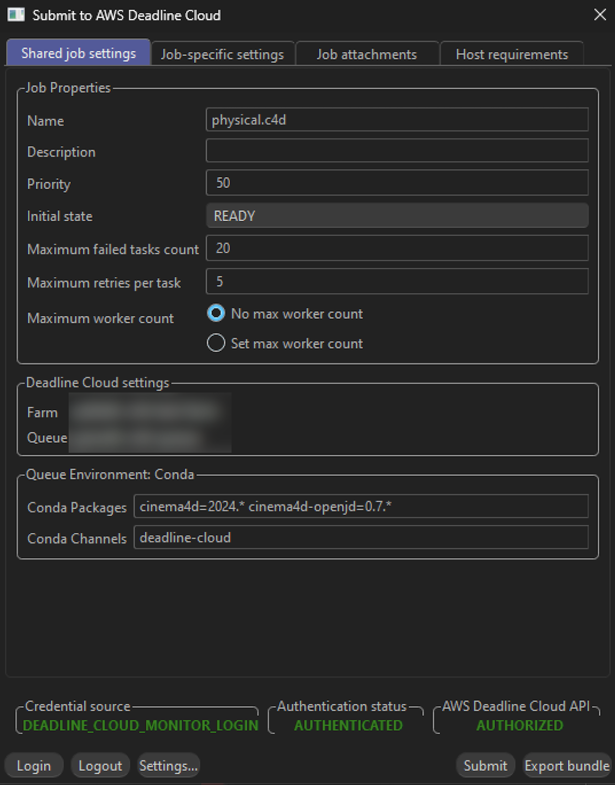
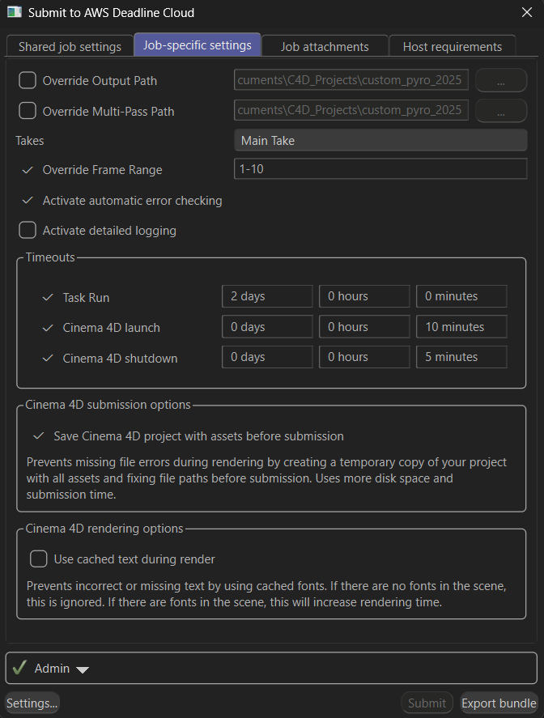

# What the Submitter Can Do

The Cinema 4D submitter transforms your rendering workflow with powerful automation and intelligent features.

## Key Benefits

### 🎯 Smart Asset Detection 🎯
Automatically finds and includes all textures, models, and other files your scene needs. No more missing asset errors or manual file hunting.

### ⚙️ Advanced Settings ⚙️
Provides additional configuration options beyond basic settings, allowing you to customize output paths, frame ranges, takes, and error checking to fit your workflow.

## Interface Walkthrough

The submitter interface has several tabs to configure your job.

### Shared Job Settings

Settings that apply to the entire job:

- **Farm Selection** - Choose which farm your job will render on
- **Queue Selection** - Select the specific queue within your chosen farm
- **Job Name** - Give your render job a descriptive name
- **Job Description** - Add optional details about your render job
- **Priority** - Set job priority for queue management
- **Initial State** - Control whether the job starts immediately or remains paused
- **Max Failed Tasks Count** - Maximum number of tasks that can fail before the job is marked as failed
- **Max Retries Per Task** - Number of times a failed task will be retried
- **Max Worker Count** - Maximum number of workers that can work on this job simultaneously
- **Conda Packages** - Specify additional conda packages required for your render
- **Conda Channels** - Define custom conda channels for package installation

### Job-Specific Settings

Settings specific to your Cinema 4D render:

- **Override Output Path** - Override the main render output path from your scene settings
- **Override Multipass Path** - Override the multipass output path for additional render passes
- **Takes** - Select which Cinema 4D takes to render
- **Override Frame Range** - Override the frame range from your scene settings
- **Automatic Error Checking** - Optional checkbox to activate/deactivate error checking during rendering
- **Task Run Timeout** - Maximum time allowed for each task to complete
- **Cinema 4D Launch Timeout** - Maximum time allowed for Cinema 4D to start up
- **Cinema 4D Shutdown Timeout** - Maximum time allowed for Cinema 4D to shut down cleanly
- **Save Cinema 4D Project with Assets** - Prevents missing file errors during rendering by creating a temporary copy of your project with all assets and fixing file paths before submission. Uses more disk space and submission time

### Optional Tabs

**Job Attachments** (optional) - Select which files will be uploaded and attached to the job. Files are automatically detected and attached by default.

**Host Requirements** (optional) - Allows you to specify which types of hosts will be eligible for picking up tasks for this job.

The submitter handles the technical details so you can focus on your creative work.

---

[FAQ and Glossary →](faq-and-glossary.md)
